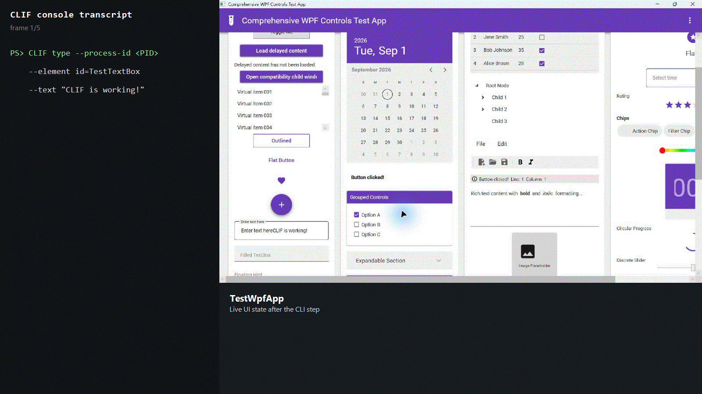

# Realtime CLI + WPF demo

The repository includes a recorded interaction pairing the CLIF console
transcript with the `TestWpfApp` window. The demo types text, clicks the button,
and toggles a checkbox while the WPF state changes on screen.



The GIF is a real Windows capture of the fixture states and the corresponding
CLI output. It is composed side by side so it remains readable in a repository
preview; it is not a simulated animation.

## Reproduce it

Build the two applications:

```powershell
dotnet build .\CLIF\CLIF.csproj --configuration Release
dotnet build .\TestWpfApp\TestWpfApp.csproj --configuration Release
```

Start `TestWpfApp.exe`, note its PID, and run the same visible sequence from a
second PowerShell window:

```powershell
$clif = (Resolve-Path .\CLIF\bin\Release\net8.0-windows\CLIF.exe).Path
$targetPid = (Get-Process TestWpfApp | Select-Object -First 1 -ExpandProperty Id)
& $clif type --process-id $targetPid --element "id=TestTextBox" --text "Hello from the realtime demo"
& $clif click --process-id $targetPid --element "id=TestButton"
& $clif interact --process-id $targetPid --element "id=TestCheckBox" --control-type checkbox --action toggle
& $clif interact --process-id $targetPid --element "id=TestComboBox" --control-type combobox --action select --value "Item 3"
& $clif interact --process-id $targetPid --element "id=TestSlider" --control-type slider --action set --value 80
```

For a slower, repeatable run, use `examples/visual-demo-test.json`:

```powershell
& $clif script .\examples\visual-demo-test.json --process-id $targetPid
```

The GIF was captured after the WPF fixture was built from this repository. UI
layout, timing, and process IDs can vary with display scaling and machine load.
